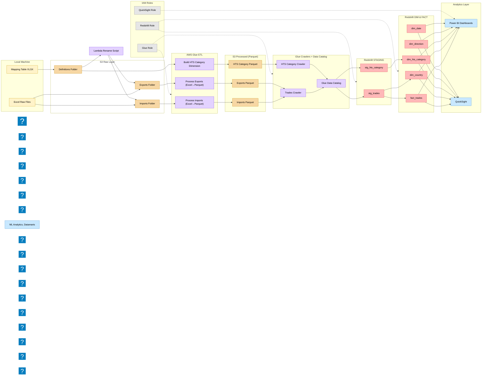

```mermaid
---
config:
  theme: mc
  layout: fixed
---
flowchart LR
 subgraph LOCAL["Local Machine"]
        L1["Excel Raw Files"]
        L2["Mapping Table XLSX"]
  end
 subgraph RAW["S3 Raw Layer"]
        R1["Definitions Folder"]
        R2["Imports Folder"]
        R3["Exports Folder"]
  end
 subgraph GLUE["AWS Glue ETL"]
        G1["Process Imports (Excel→Parquet)"]
        G2["Process Exports (Excel→Parquet)"]
        G3["Build HTS Category Dimension"]
  end
 subgraph PROC["S3 Processed (Parquet)"]
        P1["Imports Parquet"]
        P2["Exports Parquet"]
        P3["HTS Category Parquet"]
  end
 subgraph CRAWLERS["Glue Crawlers + Data Catalog"]
        C1["Trades Crawler"]
        C2["HTS Category Crawler"]
        CAT["Glue Data Catalog"]
  end
 subgraph STAGING["Redshift STAGING"]
        ST1["stg_trades"]
        ST2["stg_hts_category"]
  end
 subgraph CORE["Redshift DIM & FACT"]
        D1["dim_country"]
        D2["dim_hts_category"]
        D3["dim_direction"]
        D4["dim_date"]
        F1["fact_trades"]
  end
 subgraph BI["Analytics Layer"]
        Q1["Power BI Dashboards"]
        PB1["QuickSight"]
  end
 subgraph IAM["IAM Roles"]
        IAM1["Glue Role"]
        IAM2["Redshift Role"]
        IAM3["QuickSight Role"]
  end
    L1 --> R2 & R3
    L2 --> R1
    R1 --> Lambda1["Lambda Rename Script"] & G3
    Lambda1 --> R2 & R3
    R2 --> G1
    R3 --> G2
    G1 --> P1
    G2 --> P2
    G3 --> P3
    P1 --> C1
    C1 --> CAT
    P2 --> C1
    P3 --> C2
    C2 --> CAT
    CAT --> ST1 & ST2
    ST1 --> F1 & D1
    ST2 --> D2
    F1 --> Q1 & PB1
    D1 --> Q1 & PB1
    D2 --> Q1 & PB1
    D3 --> Q1 & PB1
    D4 --> Q1 & PB1
    IAM1 -.-> GLUE & CRAWLERS
    IAM2 -.-> CORE & STAGING
    IAM3 -.-> Q1
    n1[" "]
    n2[" "]
    n3[" "]
    n4[" "]
    n5[" "]
    n6[" "]
    n7[" "]
    n8["ML Analytics, Datamarts"]
    n9[" "]
    n10[" "]
    n11[" "]
    n12[" "]
    n13[" "]
    n14[" "]
    n15[" "]
    n16[" "]
    n17[" "]
    n18[" "]
    n1@{ icon: "gcp:cloud-monitoring", pos: "b", h: 61}
    n2@{ icon: "aws:arch-amazon-s3-on-outposts", pos: "b"}
    n3@{ icon: "aws:arch-amazon-s3-on-outposts", pos: "b", h: 48}
    n4@{ icon: "aws:arch-aws-iam-identity-center", pos: "b"}
    n5@{ icon: "aws:arch-aws-lambda", pos: "b"}
    n6@{ icon: "azure:power-bi-embedded", pos: "b"}
    n7@{ icon: "aws:arch-amazon-quicksight", pos: "b"}
    n8@{ shape: rect}
    n9@{ icon: "aws:res-aws-glue-crawler", pos: "b"}
    n10@{ icon: "aws:arch-aws-glue", pos: "b"}
    n11@{ icon: "aws:arch-aws-glue", pos: "b"}
    n12@{ icon: "aws:arch-amazon-redshift", pos: "b"}
    n13@{ icon: "aws:arch-amazon-redshift", pos: "b"}
    n14@{ icon: "aws:res-aws-glue-data-catalog", pos: "b"}
    n15@{ icon: "aws:arch-amazon-athena", pos: "b"}
    n16@{ icon: "aws:arch-amazon-cloudwatch", pos: "b"}
    n17@{ icon: "aws:arch-amazon-eventbridge", pos: "b"}
    n18@{ icon: "aws:res-amazon-redshift-query-editor-v2-0", pos: "b"}
     L1:::local
     L2:::local
     R1:::s3
     R2:::s3
     R3:::s3
     G1:::glue
     G2:::glue
     G3:::glue
     P1:::s3
     P2:::s3
     P3:::s3
     C1:::glue
     C2:::glue
     CAT:::glue
     ST1:::redshift
     ST2:::redshift
     D1:::redshift
     D2:::redshift
     D3:::redshift
     D4:::redshift
     F1:::redshift
     Q1:::bi
     PB1:::bi
     IAM1:::iam
     IAM2:::iam
     IAM3:::iam
     Lambda1:::glue
     n8:::bi
    classDef s3 fill:#f7d7a4,stroke:#c48c00,stroke-width:1px,color:#000
    classDef glue fill:#e3d2ff,stroke:#7e3ff2,stroke-width:1px,color:#000
    classDef redshift fill:#ffb8b8,stroke:#d94848,stroke-width:1px,color:#000
    classDef bi fill:#c8e8ff,stroke:#3e8ed0,stroke-width:1px,color:#000
    classDef iam fill:#e6e6e6,stroke:#8d8d8d,stroke-width:1px,color:#000
    classDef local fill:#fff3c9,stroke:#cc9a00,stroke-width:1px,color:#000
    style n1 stroke:#2962FF
    style RAW fill:#FFFFFF


```
