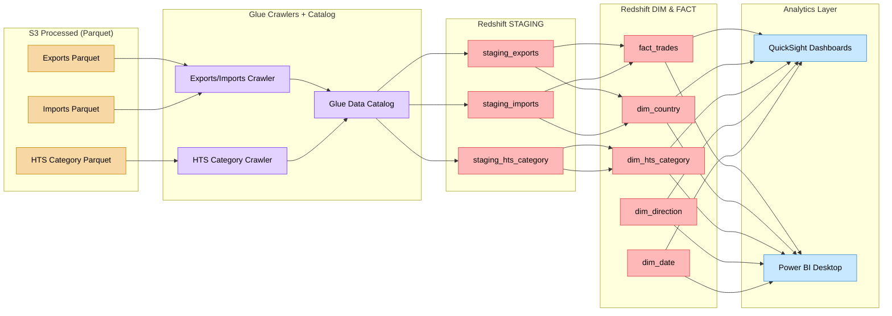

```mermaid
flowchart LR

%% ---------- COLOR CLASSES ----------
classDef s3 fill:#f7d7a4,stroke:#c48c00,stroke-width:1px,color:#000;
classDef glue fill:#e3d2ff,stroke:#7e3ff2,stroke-width:1px,color:#000;
classDef redshift fill:#ffb8b8,stroke:#d94848,stroke-width:1px,color:#000;
classDef bi fill:#c8e8ff,stroke:#3e8ed0,stroke-width:1px,color:#000;
classDef iam fill:#e6e6e6,stroke:#8d8d8d,stroke-width:1px,color:#000;
classDef local fill:#fff3c9,stroke:#cc9a00,stroke-width:1px,color:#000;

%% ---------- S3 PROCESSED ----------
subgraph S3PROC["S3 Processed (Parquet)"]
  P1["Exports Parquet"]
  P2["Imports Parquet"]
  P3["HTS Category Parquet"]
end
class P1,P2,P3 s3;

%% ---------- CRAWLERS ----------
subgraph CRAWLERS["Glue Crawlers + Catalog"]
  C1["Exports/Imports Crawler"]
  C2["HTS Category Crawler"]
  CAT["Glue Data Catalog"]
end
class C1,C2,CAT glue;

P1 --> C1 --> CAT
P2 --> C1
P3 --> C2 --> CAT

%% ---------- REDSHIFT STAGING ----------
subgraph STG["Redshift STAGING"]
  R1["staging_exports"]
  R2["staging_imports"]
  R3["staging_hts_category"]
end
class R1,R2,R3 redshift;

CAT --> R1
CAT --> R2
CAT --> R3

%% ---------- REDSHIFT DIM/FACT ----------
subgraph CORE["Redshift DIM & FACT"]
  D1["dim_country"]
  D2["dim_hts_category"]
  D3["dim_direction"]
  D4["dim_date"]
  F1["fact_trades"]
end
class D1,D2,D3,D4,F1 redshift;

R1 --> F1
R2 --> F1
R3 --> D2

R1 --> D1
R2 --> D1
R3 --> D2

%% ---------- BI LAYER ----------
subgraph BI["Analytics Layer"]
  Q1["QuickSight Dashboards"]
  PB1["Power BI Desktop"]
end
class Q1,PB1 bi;

%% FACT + DIM → BI
F1 --> Q1
F1 --> PB1
D1 --> Q1
D1 --> PB1
D2 --> Q1
D2 --> PB1
D3 --> Q1
D3 --> PB1
D4 --> Q1
D4 --> PB1
```
