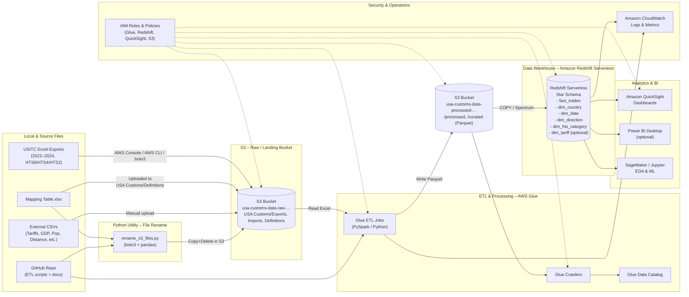

```mermaid
flowchart LR


%% 1. Local & Source Layer
subgraph Local["Local & Source Files"]
Excel["USITC Excel Exports\n(2022–2024, HTS6/HTS4/HTS2)"]
MapTbl["Mapping Table.xlsx"]
ExtData["External CSVs\n(Tariffs, GDP, Pop, Distance, etc.)"]
Git["GitHub Repo\n(ETL scripts + docs)"]
end


%% 2. S3 Raw / Landing
subgraph S3RawLayer["S3 – Raw / Landing Bucket"]
S3Raw[("S3 Bucket\nusa-customs-data-raw-…\nUSA Customs/Exports, Imports, Definitions")]
end


Excel -->|"AWS Console / AWS CLI / boto3"| S3Raw
MapTbl -->|"Uploaded to\nUSA Customs/Definitions"| S3Raw
ExtData -->|"Manual upload"| S3Raw


%% 3. File Rename Utility (Python)
subgraph Rename["Python Utility – File Rename"]
RenameScript["rename_s3_files.py\n(boto3 + pandas)"]
end


MapTbl --> RenameScript
RenameScript -->|"Copy+Delete in S3"| S3Raw


%% 4. ETL & Processed Layer
subgraph ETL["ETL & Processing – AWS Glue"]
GlueJobs["Glue ETL Jobs\n(PySpark / Python)"]
Crawler["Glue Crawlers"]
Catalog["Glue Data Catalog"]
end


S3Raw -->|"Read Excel"| GlueJobs
GlueJobs -->|"Write Parquet"| S3Proc[("S3 Bucket\nusa-customs-data-processed-…\n/processed, /curated (Parquet)")]


S3Proc --> Crawler --> Catalog


%% 5. Data Warehouse
subgraph DWH["Data Warehouse – Amazon Redshift Serverless"]
Redshift[("Redshift Serverless\nStar Schema\n- fact_trades\n- dim_country\n- dim_date\n- dim_direction\n- dim_hts_category\n- dim_tariff (optional)")]
end


S3Proc -->|"COPY / Spectrum"| Redshift


%% 6. Analytics & BI
subgraph Analytics["Analytics & BI"]
QS["Amazon QuickSight\nDashboards"]
PBI["Power BI Desktop\n(optional)"]
NB["SageMaker / Jupyter\nEDA & ML"]
end


Redshift --> QS
Redshift --> PBI
Redshift --> NB


%% 7. Security & Ops
subgraph Ops["Security & Operations"]
IAM["IAM Roles & Policies\n(Glue, Redshift, QuickSight, S3)"]
CW["Amazon CloudWatch\nLogs & Metrics"]
end


IAM -.-> S3Raw
IAM -.-> S3Proc
IAM -.-> GlueJobs
IAM -.-> Crawler
IAM -.-> Redshift
IAM -.-> QS


GlueJobs --> CW
Redshift --> CW


%% 8. DevOps
Git --> RenameScript
Git --> GlueJobs
```