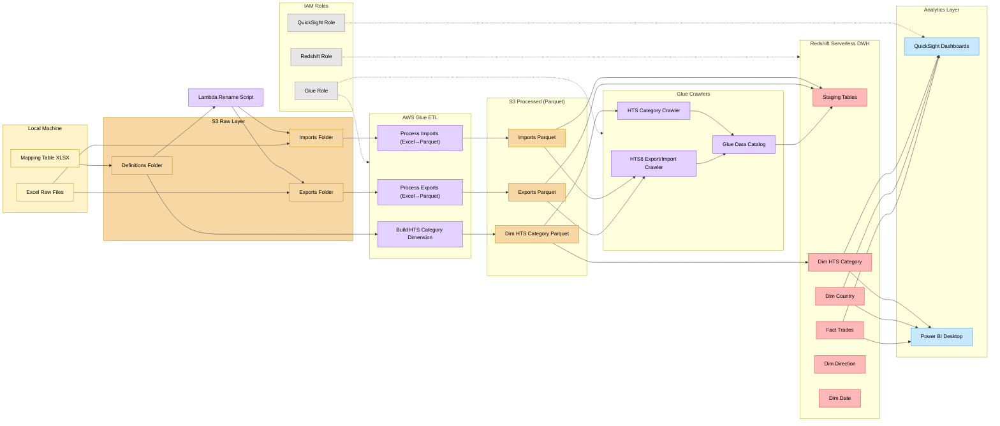

```mermaid
flowchart LR

%% ---------- COLOR CLASSES ----------
classDef s3 fill:#f7d7a4,stroke:#c48c00,stroke-width:1px,color:#000;
classDef glue fill:#e3d2ff,stroke:#7e3ff2,stroke-width:1px,color:#000;
classDef redshift fill:#ffb8b8,stroke:#d94848,stroke-width:1px,color:#000;
classDef bi fill:#c8e8ff,stroke:#3e8ed0,stroke-width:1px,color:#000;
classDef iam fill:#e6e6e6,stroke:#8d8d8d,stroke-width:1px,color:#000;
classDef local fill:#fff3c9,stroke:#cc9a00,stroke-width:1px,color:#000;

%% ---------- LOCAL ----------
subgraph LOCAL["Local Machine"]
  A1["Excel Raw Files"]
  A2["Mapping Table XLSX"]
end
class LOCAL,A1,A2 local;

%% ---------- S3 RAW ----------
subgraph S3RAW["S3 Raw Layer"]
  B1["Exports Folder"]
  B2["Imports Folder"]
  B3["Definitions Folder"]
end
class S3RAW,B1,B2,B3 s3;

A1 --> B1
A1 --> B2
A2 --> B3

%% ---------- LAMBDA RENAME ----------
L1["Lambda Rename Script"]
class L1 glue;
B3 --> L1
L1 --> B1
L1 --> B2

%% ---------- GLUE ETL ----------
subgraph GLUE["AWS Glue ETL"]
  G1["Process Exports (Excel→Parquet)"]
  G2["Process Imports (Excel→Parquet)"]
  G3["Build HTS Category Dimension"]
end
class GLUE,G1,G2,G3 glue;

B1 --> G1
B2 --> G2
B3 --> G3

%% ---------- S3 PROCESSED ----------
subgraph S3PROC["S3 Processed (Parquet)"]
  P1["Exports Parquet"]
  P2["Imports Parquet"]
  P3["Dim HTS Category Parquet"]
end
class P1,P2,P3 s3;

G1 --> P1
G2 --> P2
G3 --> P3

%% ---------- CRAWLERS ----------
subgraph CRAWLERS["Glue Crawlers"]
  C1["HTS6 Export/Import Crawler"]
  C2["HTS Category Crawler"]
  CAT["Glue Data Catalog"]
end
class CRAWLERS,C1,C2,CAT glue;

P1 --> C1 --> CAT
P2 --> C1
P3 --> C2 --> CAT

%% ---------- REDSHIFT ----------
subgraph REDSHIFT["Redshift Serverless DWH"]
  R1["Staging Tables"]
  R2["Fact Trades"]
  R3["Dim Country"]
  R4["Dim HTS Category"]
  R5["Dim Direction"]
  R6["Dim Date"]
end
class REDSHIFT,R1,R2,R3,R4,R5,R6 redshift;

CAT --> R1
P1 --> R1
P2 --> R1
P3 --> R4

%% ---------- BI ----------
subgraph BI["Analytics Layer"]
  Q1["QuickSight Dashboards"]
  PB1["Power BI Desktop"]
end
class Q1,PB1 bi;

R2 --> Q1
R2 --> PB1
R3 --> Q1
R3 --> PB1
R4 --> Q1
R4 --> PB1

%% ---------- IAM ----------
subgraph IAM["IAM Roles"]
  IAM1["Glue Role"]
  IAM2["Redshift Role"]
  IAM3["QuickSight Role"]
end
class IAM1,IAM2,IAM3 iam;

IAM1 -.-> GLUE
IAM1 -.-> CRAWLERS
IAM2 -.-> REDSHIFT
IAM3 -.-> Q1
```
