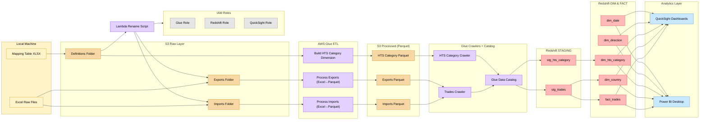

```mermaid
flowchart LR

%% ---------- COLOR CLASSES ----------
classDef s3 fill:#f7d7a4,stroke:#c48c00,stroke-width:1px,color:#000;
classDef glue fill:#e3d2ff,stroke:#7e3ff2,stroke-width:1px,color:#000;
classDef redshift fill:#ffb8b8,stroke:#d94848,stroke-width:1px,color:#000;
classDef bi fill:#c8e8ff,stroke:#3e8ed0,stroke-width:1px,color:#000;
classDef iam fill:#e6e6e6,stroke:#8d8d8d,stroke-width:1px,color:#000;
classDef local fill:#fff3c9,stroke:#cc9a00,stroke-width:1px,color:#000;


%% ===================================================================
%%                         TOP ROW (HORIZONTAL)
%% ===================================================================

subgraph LOCAL["Local Machine"]
  L1["Excel Raw Files"]
  L2["Mapping Table XLSX"]
end
class LOCAL,L1,L2 local;

subgraph S3RAW["S3 Raw Layer"]
  R1["Definitions Folder"]
  R2["Imports Folder"]
  R3["Exports Folder"]
end
class R1,R2,R3 s3;

L1 --> R2
L1 --> R3
L2 --> R1

Lambda1["Lambda Rename Script"]
class Lambda1 glue;

R1 --> Lambda1
Lambda1 --> R2
Lambda1 --> R3

%% IAM top row right side
subgraph IAM["IAM Roles"]
  IAM1["Glue Role"]
  IAM2["Redshift Role"]
  IAM3["QuickSight Role"]
end
class IAM,IAM1,IAM2,IAM3 iam;

Lambda1 --> IAM


%% ===================================================================
%%                 BOTTOM ROW (DWH + BI, HORIZONTAL)
%% ===================================================================

subgraph GLUE["AWS Glue ETL"]
  G1["Process Imports (Excel→Parquet)"]
  G2["Process Exports (Excel→Parquet)"]
  G3["Build HTS Category Dimension"]
end
class G1,G2,G3 glue;

R2 --> G1
R3 --> G2
R1 --> G3

subgraph S3PROC["S3 Processed (Parquet)"]
  P1["Imports Parquet"]
  P2["Exports Parquet"]
  P3["HTS Category Parquet"]
end
class P1,P2,P3 s3;

G1 --> P1
G2 --> P2
G3 --> P3

subgraph CRAWLERS["Glue Crawlers + Catalog"]
  C1["Trades Crawler"]
  C2["HTS Category Crawler"]
  CAT["Glue Data Catalog"]
end
class C1,C2,CAT glue;

P1 --> C1 --> CAT
P2 --> C1
P3 --> C2 --> CAT

subgraph STAGING["Redshift STAGING"]
  ST1["stg_trades"]
  ST2["stg_hts_category"]
end
class ST1,ST2 redshift;

CAT --> ST1
CAT --> ST2

subgraph CORE["Redshift DIM & FACT"]
  D1["dim_country"]
  D2["dim_hts_category"]
  D3["dim_direction"]
  D4["dim_date"]
  F1["fact_trades"]
end
class D1,D2,D3,D4,F1 redshift;

ST1 --> F1
ST1 --> D1
ST2 --> D2

subgraph BI["Analytics Layer"]
  Q1["QuickSight Dashboards"]
  PB1["Power BI Desktop"]
end
class Q1,PB1 bi;

F1 --> Q1
F1 --> PB1
D1 --> Q1
D1 --> PB1
D2 --> Q1
D2 --> PB1
D3 --> Q1
D3 --> PB1
D4 --> Q1
D4 --> PB1

```
